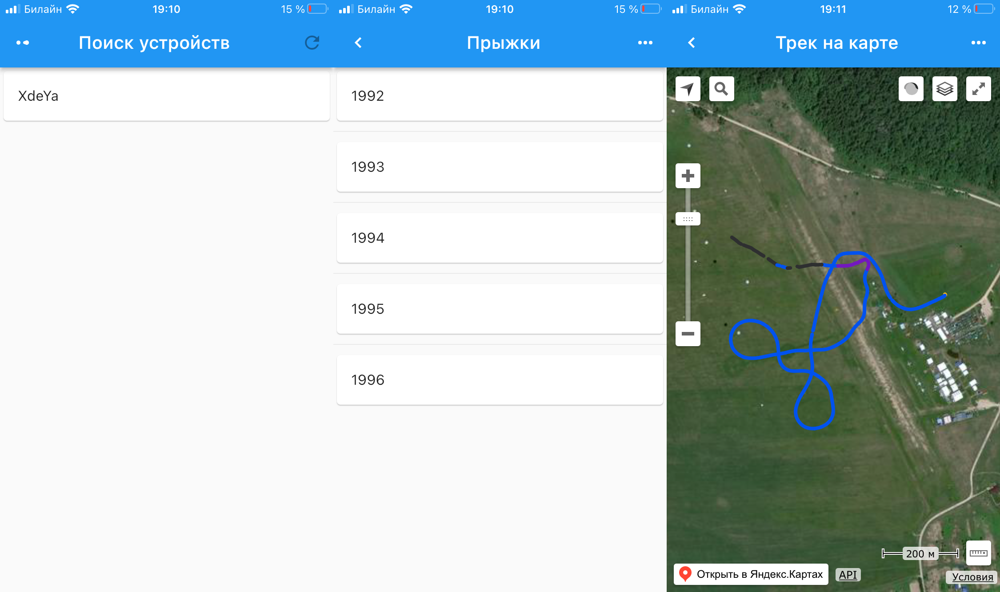

# Высотомер "Хде-Йа"

Инструмент для парашютиста - гибрид высотомера и Navi-возвращалки.

***
## Возможности

* Классические для высотомера: отображение высоты, логбук и т.д.
* Приём сигнала навигации (GPS + GLONASS)
* Отображение направления и расстояния до заранее сохранённой точки (возвращалка)
* Отображение вертикальной (по барометру) и горизонтальной (по навигации) скоростей
* В логбуке сохраняются показания высотомера и координаты на местности
* Запись трека со всеми имеющимися параметрами барометра и GPS/GLONASS-приёмника
* Взаимодействие с приложением (просмотр логбука, прыжков)

***
## Назначение

* Изначально устройство разрабатывалось как возвращалка в плохих метеоусловиях.

* Студенты, тренирующие точность приземления, смогут на земле разобрать прыжок, имея объективное средство контроля своих перемещений в пространстве.

* Мне как лот организатору групповых прыжков помогало контролировать точку выброски, сильно разгружая голову для остальных функций (взаимодействие с подопечными на борту, дополнительный контроль верности сигналов на выброску), а также помогая объективно оценить задержки выброски из-за неуспевания подготовиться вовремя к отделению.

* Инженеры, программисты микроконтроллеров, использующих Arduino и подобные средства разработки, найдут в этом устройстве полигон для экспериментов в воздухе.

>**Важно:** Устройство не может использоваться для тайного контроля за владельцем, т.к. передача данных вне устройства происходит только по запросу пользователя.

Впрочем, это открытый проект, и каждый может доработать Программное Обеспечение под свои нужды.

***
## Документация

* [Самое краткое руководство](doc/userman/simple/README.md) \[[PDF](doc/userman/xdeya-simple.pdf)|[Word](doc/userman/xdeya-simple.docx)\]
* [Как это сделать?](doc/userman/howdo/README.md) \[[PDF](doc/userman/xdeya-howdo.pdf)|[Word](doc/userman/xdeya-howdo.docx)\]
* [Описание Меню прибора](doc/userman/menu/README.md) \[[PDF](doc/userman/xdeya-menu.pdf)|[Word](doc/userman/xdeya-menu.docx)\]
* [Технические особенности и разъяснения](doc/userman/tech/README.md) \[[PDF](doc/userman/xdeya-tech.pdf)|[Word](doc/userman/xdeya-tech.docx)\]

* [Модификации](doc/models/README.md) - подробное описание аппаратных вариантов и их особенностей с фото.
* [Используемые комплектующие](doc/build/hardware.md)
* [Сколько стоит и где купить](doc/build/price.md)
* [Исходники](doc/code/README.md) - где, что лежит, права на использование, помощь при компиляции.
* [Где скачать](doc/download.md)

***

<video width="375" controls title="demo">
  <a href="doc/demo.mp4"><source src="doc/demo.mp4" type="video/mp4"></a>
</video>

***
## Контакты

Меня зовут Николай, веду проект `Высотомер + Навигация`. Связаться со мной можно:

* Telegram канал с информацией: [@xdeya](https://t.me/xdeya)
* Telegram: [Cliff](https://t.me/cliffa_net)
* cliff_mail@mail.ru
* Cайт проекта: [xdeya.ru](http://xdeya.ru)
