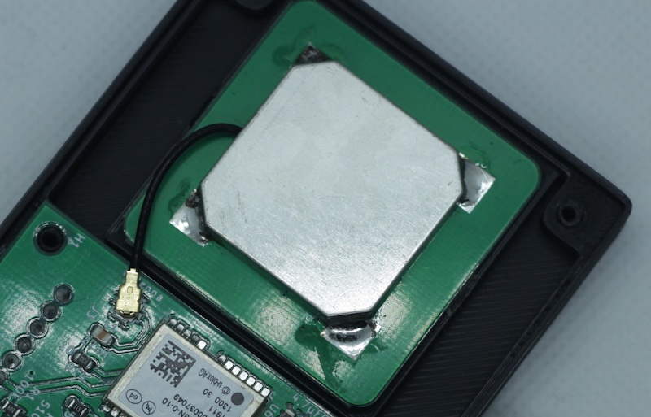
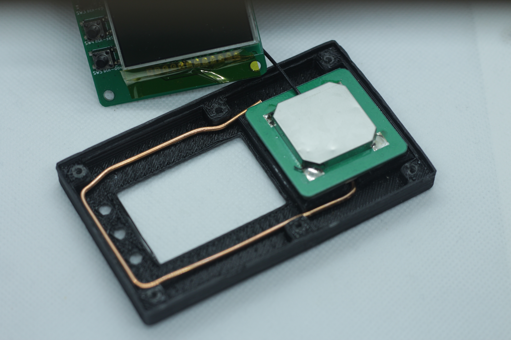

# Наработки по качеству GPS/GLONASS сигнала

Пока что приём сигнала в ЛА, особенно, на высоте выше 3000м оставляет желать лучшего.

## Сейчас антенна выглядит вот так

## Случайно успешный эксперимент на v.0.3

Результат такого колхоза - гораздо более уверенный приём, даже в квартире, где без доработки ничего не ловило.

К сожалению, я не радиолюбитель и мои познания в радиоприёме очень слабы. Я не знаю, почему стало лучше, но факт, что стало ловить заметно лучше.

Пока доработку только тестирую. Но в месте пайки доработки к оригинальной антенны - очень слабое там место и от вибрации оно может отвалиться. Пока держится.

## Другой вариант корпуса для v.0.4

**FIXME** (В процессе доработки) Более удлинённый с выносом антенны из-под дисплея
 
**По умолчанию доработку не делаю!** Потому что выглядит как колхоз, надёжность не изучена.
 