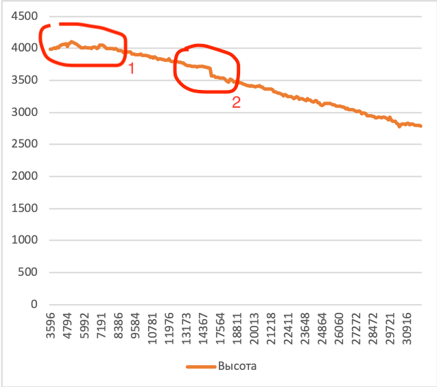

# Хде-Йа - Аналитика

Меня часто спрашивают, зачем это устройство, оно же большое, используется не самый энергоэффективный чип.

Да, у этого устройства много проблем, сложностей. Однако, мне сильно не хватало GPS-навигатора для нужд контроля своей позиции под парашютом. При этом я хотел совместить в нём ряд удобств, которых мне всегда не хватало в дорогих высотниках от крупных известных брендов.

Сейчас я нахожусь на рубеже принятия решения, что дальше делать с этим проектом:

* Если он окажется интересным для пользователей при всех его текущих проблемах, это будет мотивировать меня к дальнейшей разработке и устранению проблем.
* Среди парашютистов я встречал довольно много инженеров, которые пытались и пытаются изготавливать какие-то свои устройства (высотники, пищалки и т.п.) для нашей деятельности. Может для них этот проект поможет этим людям в их разработках.
* Может, кто-то захочет присоединиться к этому проекту. Я открыт для взаимодействия и не планирую оставлять только единоличное право на его ведение.
* Может кто-то из инструкторов подкинет какие-либо идеи, как это можно использовать в обучении.

Однако, если окажется, что проект, кроме меня, больше никому не интересен, скорее всего, на этом его развитие остановится, а я направлю свои силы в другие идеи.

## Текущие возможности и Области применения

Основные аргументы, побудившие к реализации данного проекта:

* Дороговизна современных GPS/GLONASS-решений в качестве возвращалки.
* Желание синхронизировать логбук с внешним миром, задолбался руками вести учёт прыжков.
* Желание иметь потенциальную возможность допрограммировать устройство.

Все остальные фишки - уже скорее следствие.

* Можно использовать для купольного пилотирования (разбор точности при заходе на приземлении и режимов работы купола).
* Можно доработать какую-то свою функцию в готовое железо и использовать её.
* Мне пригождалось в качестве комфортного контроля точки выброски.
* Можно проконтролировать свои навыки ориентирования на местности с высоты (точность определения нахождения точки относительно себя самого).

## Проблемы

### 1. Уровень приёма внутри ЛА

>Ищу способы решения, нужна помощь знающих радиолюбителей.

### 2. Энергосбережение

>Половину ёмкости аккумулятора отъёдает микропроцессор приёма GPS/GLONASS-сигнала. Если его отключать, когда он не нужен, это позволит существенно продлить время работы до ближайшей зарядки.
>
>Схема и чип выбраны тоже не самые эффективные.

### 3. Стабильность распознавания начала свободного падения

>Начало прыжка чаще всего определяется с точностью до 2-3 секунд. Но вот не всегда принимается верное решение, было ли свободное падение или это раскрытие под бортом.
>
>Выражается проблема в нулевом времени свободного падения.
>
>Тут пока нет достаточной статистики. В этом может помочь каждый - присылайте свои треки прыжков. А если приложете ещё и видео прыжка - это тоже сильно поможет.

### 4. Объём места для треков

>Внутри применённого чипа встроена довольно большая flash-память. Однако, её недостаточно, чтобы хранить треки более, чем для 3-6 прыжков. При достаточной заинтересованности проектом - дальнейшее развитие предполагает использование внешней SD-карты.
>
>Возможно, было ошибкой, рассчитывать на внутреннюю память без использования SD-карты с самого начала. Но так проект проще, компактнее и при этом имеет рабочую форму.

### 5. Подвисания при автоматическом старте трека

>Примерно через 5-8 секунд после отделения от ЛА (в момент принятия решения, что начался прыжок) устройство подвисает и не реагирует ни на что несколько секунд.
>
>Происходит это из-за старта записи трека. Именно в начале прыжка на flash-память пишется трек за прошедшие 10 секунд, чтобы прыжок записался с самого начала. Именно это приводит к подвисанию.
>
>Это известная проблема, не решённая пока что программным образом. Скорее всего, со временем проблема будет решена, а пока что её надо иметь ввиду.
>
>Костыльно сейчас её можно решить выставлением в настройках высоты, на которой запись трека будет стартовать автоматически ещё в подъёме. Это удлинит объём записываемого за один прыжок трека (меньше треков влезет), но это позволит включить трек до начала прыжка и автоматически выключить при приземлении. При этом подвисаний при начале прыжка уже не будет.

1. Момент отделения. Вот так выглядит нестабильность показаний высотомера в условиях сильных турбулентных потоков у обреза двери.

2. Скачок замеров в момент атоматического старта записи трека. Здесь всё устройство подвисает, пока пишет показания за предыдущее время на протяжении около 5 секунд.

### 6. Отсутствие аппаратного компаса.

>В существующих аппаратных модификациях стороны света определяются не по компасу, а по направлению движения. Предполагается, что мы держим устройство перед собой ровно и движемся вперёд.
>
>Такой подход вполне комфортен при движении внутри ЛА. Однако под парашютом такой способ навигации весьма затруднителен в понимании, хоть и используется во многих сущействующих возвращалках.
>
>Установить аппаратный компас в устройство - уже является одной из запланированных задач на ближайшие аппаратные проработки.
>
>В версиях прошивки, начиная с `0.5.3`, север всегда сверху дисплея, если нет аппаратного компаса. Если компас есть, то обозначение севера ориентируется по компасу.

## Также

* [Используемые комплектующие](hardware.md)
* [Планы в развитии](future.md)
* [Сколько стоит и где купить](price.md)
