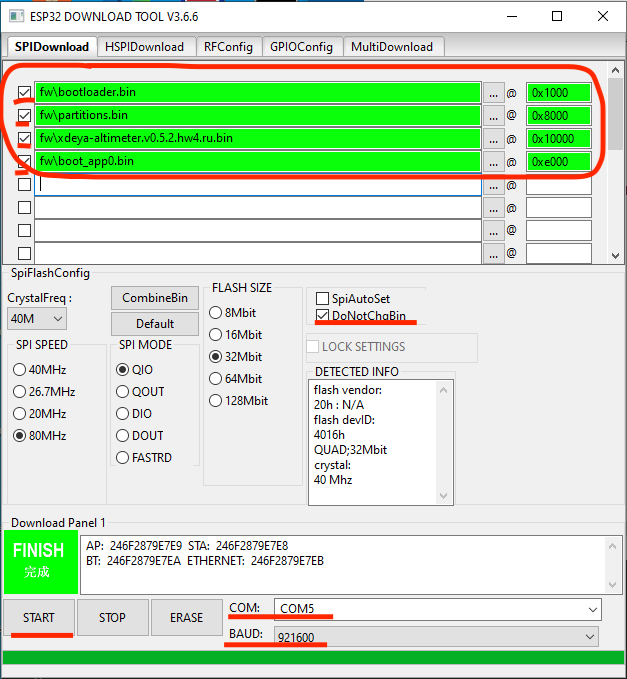

# Хде-Йа - Исходники

## Открытость проекта

Проект полностью открыт. Закрывать - не планирую. На коммерческую основу ставить - не планирую.

Как минимум, для коммерции потребуются согласования по использованию в этом проекте исходного кода других разработчиков, а ещё сертификация использования GPS/GLONASS-приёмника и трекера.

[Репозиторий на github.com](https://github.com/cliffanet/xdeya-altimeter)

## Можно ли использовать исходники в своих проектах

Да, никаких возражений против использования исходного кода в своих проектах. Однако, будет лучше, если вы будете ссылаться на использование данного проекта. Это один из важных мотивационных факторов к дальнейшему развитию.

Это относится и к любительским проектам, и к крупным бесплатным, и к коммерческим.

## Где и что находится

* Исходный код прошивки

    Включает: директорию [`src`](https://github.com/cliffanet/xdeya-altimeter/tree/master/src), файлы [`def.h`](https://github.com/cliffanet/xdeya-altimeter/blob/master/def.h) и [`xdeya-altimeter.ino`](https://github.com/cliffanet/xdeya-altimeter/blob/master/xdeya-altimeter.ino). Для компиляции в среде Arduino нужно только это.
    
    Есть ещё скрипт [`fw`](https://github.com/cliffanet/xdeya-altimeter/blob/master/fw) - он написан на языке [perl](https://www.perl.org/) и служит для удобства компиляции и загрузки прошивки из консоли с помощью утилиты arduino-cli. Про это подробно расписано в подразделе [Как собрать исходный код у себя](#как-собрать-исходный-код-у-себя)

* Исходники электрической схемы и печатной платы

    Всё находится в директории [`hw`](https://github.com/cliffanet/xdeya-altimeter/tree/master/hw). Среда разработки: [KiCad EDA](https://www.kicad.org/)

* Исходники 3D-моделей для печати корпуса

    Директория [`box`](https://github.com/cliffanet/xdeya-altimeter/tree/master/box). Среда: [SketchUp](https://www.sketchup.com/ru)
    
    В имени skp-файла может встречаться `noroundcorner` - это исходник без скруглённых краёв. Оставлен, чтобы было проще поправить, а скругление краёв я всегда делаю в самом конце, т.к. отменить это действие никак нельзя. Файл xdeya.skp - это тот же файл, но  уже конечный вариант со скруглением.
    
    Тут же лежат экспортированные в `stl` файлы моделей. В имени файлов зашифровано:
    
    * `top` / `bottom` - верхняя и нижняя часть корпуса
    * `cord` / `lent` - крепление под эластичный шнур или под эластичную ленту
    * `long` - удлинённый корпус
    * `bold` - утолщённый корпус для более жирного аккумулятора

* Архив
    
    Директория [`arch.hw`](https://github.com/cliffanet/xdeya-altimeter/tree/master/arch.hw). Тут лежат исходники под различные модификации: `плата` (включая gerber-файлы для печати) и `корпус`.

## Электронные компоненты:

* Дисплей JLX19292G: COG 192x96 на чипе ST75256 c 24-pin шлейфом ([например](https://aliexpress.ru/item/1005002157371258.html))

## Как прошить с помощью программатора

### Подключение к компьютеру (версия v.0.3)

Вам потребуется переходник USB-to-UART, т.к. в устройстве его нет. Подойдёт любой с AliExpress.

На плате устройства есть вот такой разъём:

* `gnd` - к `GND` переходника.
* `3v3` - к выходу питания `+3.3v` переходника. Этот вывод можно и не подключать, а питать устройство от аккумулятора или через разъём MicroUSB.
* `tx` - к `RX` переходника.
* `rx` - к `TX` переходника.

При подключении переходника USB-to-UART к компьютеру в списке устройств должен появиться новый последовательный порт (COM-порт). Если этого не произошло, скорее всего, необходимо установить драйверы для этого переходника.

Для программирования данного устройства его надо перевести в download-режим. Для этого удерживая кнопку `boot` на плате устройства, нажмите и отпустите кнопку `reset`. После этого можно отпускать кнопку `boot`.

Теперь устройство готово к загрузке на него прошивки.

### Подключение к компьютеру (версия v.0.4 и более поздние)

У этой модификации на борту уже есть переходник USB-to-UART, поэтому для подключения к компьютеру достаточно подключить его кабелем через разъём MicroUSB на устройстве.

При подключении устройства к компьютеру через USB-кабель, в списке устройств должен появиться новый последовательный порт (COM-порт). Если этого не произошло, потребуется установить драйвер для чипа CP2102 под вашу операционную систему.

Теперь устройство готово к загрузке прошивки.

### Загрузка прошивки на устройство

* Берём [готовый файл](https://github.com/cliffanet/xdeya-altimeter/releases) прошивки (один нужной версии)

* Дополнительные файлы прошивки

    для Flash 4MByte: [boot.zip](https://github.com/cliffanet/xdeya-altimeter/raw/master/boot.zip)

    для расширенной Flash 16Mbyte: [boot.v6.zip](https://github.com/cliffanet/xdeya-altimeter/raw/master/boot.v6.zip)

* Скачиваем и запускаем [Flash Download Tools](https://www.espressif.com/en/support/download/other-tools)

* Нажимаем кнопку `ESP32`

* Указываем 4 файла и адреса к ним:

    * `bootloader.bin` - адрес 0x1000
    * `partitions.bin` - адрес 0x8000
    * `boot_app0.bin` - адрес 0xe000
    * основной файл прошивки - адрес 0x10000

* Ставим галку DoNotChgBin.

* Выбираем COM-порт, через который подключено устройство.

* BAUD : Это скорость, на которой будет заливаться прошивка. Должна работать любая, в т.ч. максимальная. Но может оказаться, что при высоких скоростях запись будет прерываться.

* Жмем кнопку `START`

После этого начнётся процесс заливки прошивки.

Для аппаратной версии [v.0.3](../models/01.v.0.3.md) для запуска устройства после заливки прошивки требуется нажать кнопку `reset`.

Для аппаратной версии [v.0.4](../models/02.v.0.4.md) ничего дополнительно не требуется.

## Как собрать исходный код у себя

### Используемые сторонние библиотеки для среды Arduino

* [Adafruit_BMP280_Library](https://github.com/adafruit/Adafruit_BMP280_Library)
* [Adafruit_BusIO](https://github.com/adafruit/Adafruit_BusIO) `ver1.9.6` (Необходимая зависимость для Adafruit_BMP280_Library)
* [Adafruit_Unified_Sensor](https://github.com/adafruit/Adafruit_Sensor) (Необходимая зависимость для Adafruit_BMP280_Library)
* [RTClib](https://github.com/adafruit/RTClib)
* [U8g2](https://github.com/olikraus/u8g2)

### В среде Arduino

* Используемая плата: ESP32 Dev Module

    В настройках среды Arduino в поле `Дополнительные ссылки для Менеджера плат` добавить:
    
    https://raw.githubusercontent.com/espressif/arduino-esp32/gh-pages/package_esp32_dev_index.json
    
    В Менеджере плат найти esp32 и установить версию 2.0.0
    
    **ВНИМАНИЕ** В версии 2.0.1 есть бага, при которой повторная WiFi-синхронизация вызывает перезагрузку устройства.

* Откройте в Arduino файл xdeya-altimeter.ino
* Компилируйте, загружайте

### С помощью arduino-cli

Этот способ не работает в Windows, т.к. там нет привычного shell.

Потребуются:

* установленные для Arduino библиотеки
* установленная для Arduino плата
* arduino-cli
* perl

Для компиляции используется скрипт [`fw`](../../fw), который находится в этих исходниках.

Пример запуска:

    ./fw compileupload 4 ru /dev/cu.SLAB_USBtoUART
