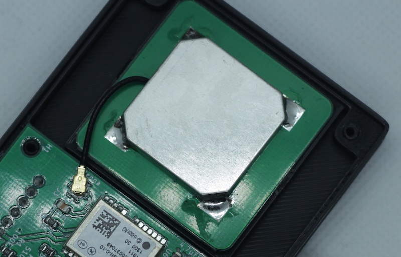
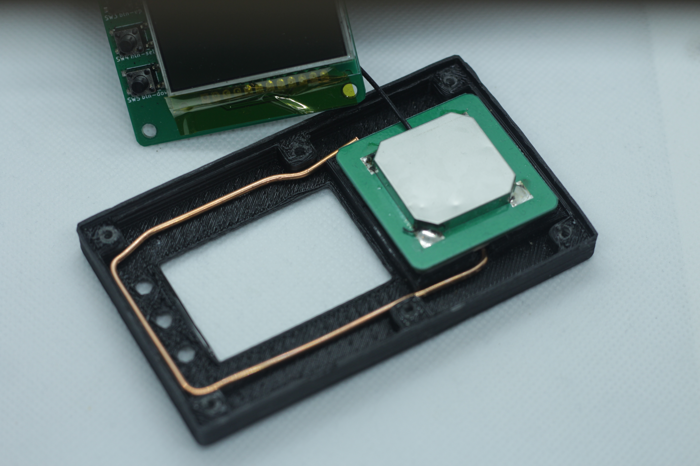
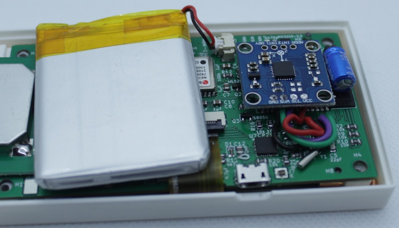
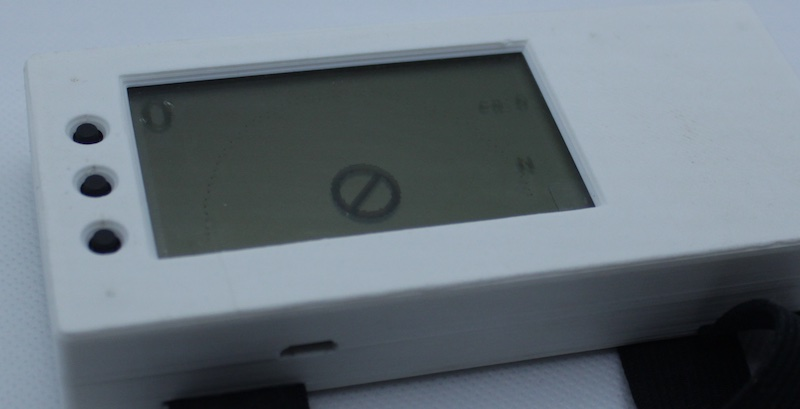

# Хде-Йа - Экспериментальные наработки

Местами это выглядит как колхоз, поэтому ничего из этого раздела `не делается по умолчанию`, только по запросу.

## Качество GPS/GLONASS сигнала

Пока что приём сигнала в ЛА, особенно, на высоте выше 3000м оставляет желать лучшего.

### Сейчас антенна выглядит вот так

### Случайно успешный эксперимент на v.0.3

Результат такого колхоза - гораздо более уверенный приём, даже в квартире, где без доработки ничего не ловило.

К сожалению, я не радиолюбитель и мои познания в радиоприёме очень слабы. Я не знаю, почему стало лучше, но факт, что стало ловить заметно лучше.

Пока доработку только тестирую. В месте пайки этой доработки к оригинальной антенне - очень слабое там место, и от вибрации оно может отвалиться. Пока держится.

## Аппаратный компас

На данный момент - в процессе разработки.

### Как сейчас работает компас

Включается в меню `Настройки` -> `Использовать компас`.

Если компас выключен, то север на приборе будет всегда сверху.

Если компас включен, то вся "карта" будет поворачиваться в направлении севера.

### Стабильность

* Как и обычный стрелочный компас, цифровой компас точно так же сильно искажает показания
при любом физическом воздействии (ускорение, тряска, удары). Чем в бОльшем физическом покое будет устройство,
тем валидней будут показания.

* Реальная точность показаний сейчас изучается.

### Как выглядит доработка для v.0.4

Для аппаратной версии `v.0.3` доработка примерно такая же.

### Где взять прошивку

Поддерживается прошивкой, начиная с [v0.6.0](https://github.com/cliffanet/xdeya-altimeter/releases/tag/v0.6.0)

