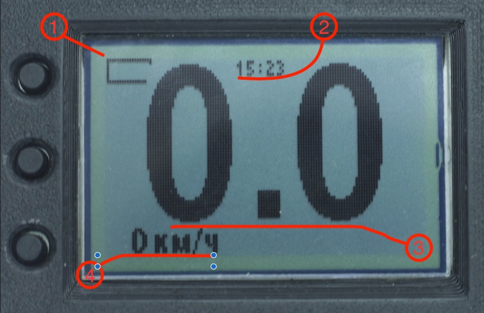

# Главные экраны

Переключение между страницами на главном экране - нажатие на `среднюю кнопку`.

Кнопки `Вверх` и `Вниз` работают только по `длинному нажатию`, их функциями можно управлять в меню `Параметры` -> `Функции кнопок`.

## GPS/GLONASS + Высотомер

1. Индикатор заряда батареи.
2. Текущее время (синхронизируется по GPS-сигналу).
3. Высота по барометру (метры).
4. Временное отображение режима высотомера (по текущей высоте, скорости и вертикальному направлению движения).
5. Вертикальная скорость (м/с).
6. Расстояние до выбранной точки (метры или километры).
7. Горизонтальная скорость.
8. Режим работы GPS/GLONASS приёмника (во включенном состоянии отображает число найденных спутников).
9. Номер выбранной точки и направление к ней.

Буквы `N` `S` `W` `E` - означают стороны света, как на компасе.

## Высотомер

1. Индикатор заряда батареи.
2. Текущее время (синхронизируется по GPS-сигналу).
3. Высота по барометру (километры).
4. Вертикальная скорость (км/ч).

