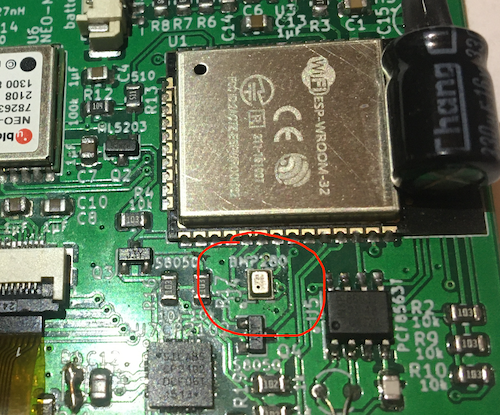
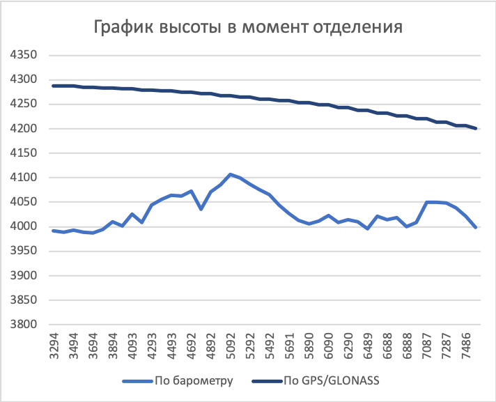

# Высотомер

Как и во всех других высотомерах, для определения текущей высоты применяется датчик давления.

## Датчик

Используемый датчик давления: BMP280.

Этот датчик хорошо зарекомендовал себя во многих проектах многочисленных разработчиков высотомеров и пищалок.

У него очень низкое энергопотребление, высокая скорость ответа, миниатюрные размеры, простота монтажа.

На плате датчик выглядит так:

## Калибровка высоты по текущему давлению

Устройство самостоятельно подстраивает давление нулевой высоты, пока Вы находитесь на земле.

Автоматическую подстройку можно отключить через `меню настроек`. Однако, в этом случае в течение дня определение высоты может уходить на 10, 20 или даже 50 метров в ту или другую сторону.

Если вы поднимитесь на высоту `40 м` и более, автоматическая подстройка будет отключена до момента, пока вы не вернётесь обратно на нулевой уровень.

В случае, если после приземления высотомер будет показывать более 40 метров и из-за этого не будет корректироваться, Вы можете сами вручную сбросить `уровень земли` через `меню настроек`.

## Сложности вычисления высоты по барометру

Основной проблемой для любых приборов, измеряющих высоту по барометру, являются зоны турбулентности и зоны повышенного давления. Особенно заметно это проявляется на скоростях `более 20 м/с` в любом направлении.

**Зоны турбулентности** встречаются достаточно часто:

* В летательном аппарате - это обычно зона у открытой двери.
* В свободном падении существенно турбулентный поток возникает над рукой, на которой закреплён высотомер.

**Зона повышенного давления** формируется в двух случаях:
* если измеряющее давление устройство находится под телом в непосредственной близости от него в свободном падении;
* в салоне самолёта, если размеры двери небольшие по сравнению с объёмом салона.

Например, в инструкциях ко многим страхующим приборам в явном виде это описано. И указывается, что в положении на животе (когда прибор находится в зоне пониженного давления на спине) прибор сработает на `80 метров` ниже, чем в положении на спине (когда прибор находится в зоне повышенного давления).

В некоторых случаях погрешность показаний может достигать `более ±100 метров`. Помните об этом при учёте показаний с подобных приборов, в т.ч. и этого.

Вот пример замера высоты в момент отделения с ЛА с боковой дверью. Поля: время в мс, высота по барометру и высота по GPS (над уровнем моря). Частота замеров - 10 раз в секунду, однако, данные с GPS-приёмника идут 5 раз в секунду.

    3294		3991		4288
    3396		3989		4287
    3494		3993		4287
    3596		3989		4285
    3694		3987		4285
    3796		3994		4283
    3894		4010		4283
    3996		4002		4282    <-- Примерно тут высотник оказался за обрезом
    4093		4025		4282
    4197		4009		4279
    4293		4044		4279
    4395		4056		4277
    4493		4064		4277
    4595		4063		4274
    4692		4072		4274
    4794		4035		4272
    4892		4071		4272
    4994		4085		4268
    5092		4107		4268
    5196		4100		4265    <-- Примерно тут уже началось падение
    5292		4087		4265
    5394		4075		4261
    5492		4065		4261
    5594		4044		4257
    5691		4027		4257
    5793		4013		4253
    5890		4006		4253
    5992		4011		4249
    6090		4023		4249
    6194		4009		4243
    6290		4014		4243
    6392		4010		4238
    6489		3996		4238
    6591		4022		4232
    6688		4015		4232
    6790		4019		4226
    6888		4000		4226
    6990		4009		4220
    7087		4050		4220
    7191		4050		4214
    7287		4048		4214
    7389		4039		4207
    7486		4021		4207

Далее показания высоты уменьшались более последовательно.

Приведён пример отделения горизонтальной 8-way в захватах из самолёта Л-410. Устройство было на руке участника, отделяющегося из салона. А отделение мы завалили :smile:. Если устройство повесить на руку, отделяющегося снаружи, там всё ещё веселее.

Всё это создаёт значительные трудности в определении момента отделения. У высотомеров более известных брендов трудности те же самые, именно поэтому не стоит сильно доверять показаниям в вашем логбуке.

Напрашивается сразу же предложение - ориентироваться на GPS. Но обычно на отделении, особенно пока вывешиваемся и берём друг друга за захваты, в этот момент сигнал теряется и возобновляется только через какое-то время после отделения.

## Алгоритм определения фаз прыжка

В отличие от более простых высотомеров, где не так критична точность определения начала прыжка, в этом устройстве при начале прыжка требуется засечь текущие координаты и включить запись трека. Если точность определения прыжка будет низкой, полезность данного устройства будет сомнительной.

1. Каждый прыжок должен начинаться с подъёма. Эта фаза включается, когда примерно 5 секунд продолжается набор высоты. Без этой фазы все остальные невозможны.

2. Снижение может возникать по многим причинам:
    - удержание полёта на одном эшелоне,
    - временное снижение ЛА,
    - снижение некоторых ЛА при сбросе газа `на боевом`,
    - резкие изменения давления.
    
    Поэтому для однозначного определения, что это именно отделение, скорость снижения дожна быть не менее 15 м/с на протяжении 5 секунд. В этом случае принимается решение, что это всё-таки отделение и падение.
    
    Моментом отделения считается тот, что был 5 сек назад на момент принятия решения. Опыты показали, что это максимально близко к правде, если отделяться изнутри салона. Если сначала вывешиваться за бортом, то ошибка определения момента отделения достигает 2 сек.

3. Теперь надо решить, открыли ли мы парашют под бортом или падаем в свободном падении. Если за последующие 3 секунды скорость снижения достигнет 35 м/с, считается, что прыжок начался со свободного падения. Иначе, в логбук будет записано нулевое время свободного падения.

4. Если у нас всё-таки случилась фаза свободного падения, то она завершится, если около 6 секунд скорость снижения будет ниже 12 м/с. Моментом открытия будет тот, что был 6 секунд назад перед принятием решения.

5. Момент приземления - если высота ниже 50 метров сохраняется более 6 секунд.

Для того, чтобы в логбук писать верные значения, т.к. определение моментов начала каждой фазы происходит с опозданием в несколько секунд, ведётся непрерывный лог параметров на протяжении прошедших 10 секунд. И после принятия решения для каждой фазы нетрудно получить параметры начала фазы.

Этот алгоритм показал стабильный и достаточно точный результат. Однако, иногда фаза свободного падения не засчитывается.

Иногда на выброске ЛА длительное время достаточно интенсивно снижается. Обычно пилоты намеренно начинают снижение на выброске, чтобы не допустить свала. Однако, это может привести к ошибочному принятию решения о моменте начала прыжка.

При достаточно большой статистике, подтверждённой средствами объективного контроля, получится доработать алгоритм для получения более точных показаний. Для этого достаточно присылать трек прыжка вместе с видео этого прыжка разработчикам с пометкой: `для доработки алгоритма определения прыжка`.
