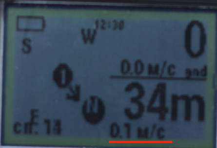

# Навигация

Приём GPS/GLONASS-сигнала происходит на активную патч-радиоантенну внутри пластикового корпуса устройства.

Далее сигнал приходит в микрочип u-blox m8n. Этот чип умеет принимать одновременно сигналы GPS и GLONASS.

## Отображение на главном экране

* В старых версиях прошивки (`v0.5.0` и более ранних):

    Основные состояния NAV-индикации:
    
    * Нет сигналов от спутников.
    
    * Компас - сигнал от спутника принимается, но точка назначения не указана.
    
    * Направление и расстояние до точки назначения.
    
    * Точка назначения достигнута (в радиусе 8 метров).
    
    Также можно увидеть горизонтальную скорость:
    
    

* В более свежих версиях (`v0.5.3` и выше):
    
    * При подключенном аппаратном компасе - отображения сторон света на экране соответствует показаниям компаса.
        
    * При отсутствии компаса - север всегда сверху

    * Два варианта отображения:
        
        * Страница "навигация + высотомер"
        
        * Страница "навигация" - тут тоже есть отображение высоты, но основное внимание навигации.
    

## Направление движения (компас)

Направление нашего движения отображается как на карте, где мы в центре "карты". Самой карты нет, но вы понимаем, куда мы движемся относительно сторон света и где находится точка.

Начиная с версии `v0.5.3` отображения сторон света на экране соответствует показаниям компаса, если таковой есть. Т.е. при наличии компаса "карта" будет вращаться. При отсутствии компаса - север всегда будет вверху дисплея.

### Калибровка компаса

Т.к. производство китайских деталей не отличается стабильностью, показания, снимаемые магнитометром от экземпляра к экземпляру сильно расходятся.

Если компас показывает нестабильно направление севера, это значит, что магнетометр необходимо калибровать. Эта функция находится в меню `Система` - `Калибровка магнетометра`.

Суть калибровки заключается в нахождении минимальных и максимальных значений магнетометра. Для этого каждую из осей (X, Y, Z) необходимо направлять вдоль магнитных линий Земли.

> На широте Москвы магнитные линии направлены примерно под углом 60° к поверхности.

Для каждой оси прибора необходимо сделать две манипуляции - в прямом направлении магнитной линии и в обратном. Каждый раз будет определяться либо минимум,
либо максимум по выбранной оси. Минимум и максимум определяем незначительными отклонениями вдоль предполагаемой оси.

Для сохранения результатов - длинное нажатие средней кнопкой.

Для выхода из калибровки - короткое нажатие на среднюю кнопку.

## Направление в старых прошивках (до `v0.5.3`)

В устройстве нет компаса, поэтому определить стороны света относительно сторон устройства невозможно.

Однако, стороны света можно определить относительно вектора нашего движения. В прошивках до `v0.5.2` включительно изображение на экране устроено так, будто вектор нашего движения направлен от верхнего ребра устройства:

В этом случае показания сторон света будут верными.

**Важно** помнить, принципиально - направление нашего движения, а не куда мы смотрим. Мы можем двигаться спиной вперёд.    

## Качество принимаемого сигнала

К сожалению, качество принимаемого сигнала - одна из основных решаемых сейчас проблем. Обшивка большинства летательных аппаратов очень хорошо экранирует любые радиосигналы, в т.ч. - GPS/GLONASS.

В городе на улице приём средне-уверенный.

В квартире - спутники можно поймать только у окна.

На аэродроме на улице обычно нет проблем с приёмом сигнала. Количество принимаемых спутников обычно не ниже 16.

### Внутри летательного аппарата

* v.0.3 - экран небольшой, антенна расположена так, чтобы её ничто не закрывало, кроме пластика корпуса.
* v.0.4 - экран намеренно увеличен почти на всю площадь, но ради этого пришлось пожертвовать открытой площадью антенны - она почти полностью закрыта, это весьма пагубно повлияло на уровень  принимаемого сигнала.

Статистика приёма внутри разных ЛА:

|                        | v.0.3                                                                                                      | v.0.4                                                                                                     |
|:----------------------:|:----------------------------------------------------------------------------------------------------------:|:---------------------------------------------------------------------------------------------------------:|
| Ан-2                   | У кабины - неплохо, у двери (даже открытой) часто пропадает.                                               | Плохой приём, к моменту отделения спутники всегда надёжно терялись.                                       |
| Ан-28                  | У кабины ловит плохо, у рампы до 3000м хорошо, выше - только у окна.                                       | Плохой приём, к моменту отделения спутники всегда надёжно терялись.                                       |
| Л-410                  | На удивление - хороший устойчивый сигна везде, иногда может потребоваться поднести к окну.                 | Неустойчивый приём, часто приходится подносить к окну.                                                    |
| Ми-9 с открытой рампой | Хороший устойчивый приём, иногда лучше подносить к окну или на максимальное расстояние от любого человека. | - нет статистики -                                                                                        |

### Реакция на нажатие на кнопки управления

Антенна, принимающая навигационный сигнал, в устройстве находится с противоположной от кнопок управления стороны.

Непонятно, почему, но при длительном беспрерывном управлении кнопками устройства снижается уровень приёма GPS/GLONASS-сигнала. Спутники постепенно теряются. Эффект проявляется даже на улице при хорошем приёме.

Если делать небольшие перерывы после нажатий на кнопки, то обычно, качество приёма от этого не страдает.

Об этом стоит помнить:

* в летательном аппарате, т.к. там уровень приёма изначально плохой;
* при сохранении координат выбранной точки.

Когда мы пытаемся сохранить координаты выбранной точки, для этого надо длительное время нажимать на кнопки управления. И когда мы доходим до самого сохранения, спутники к тому моменту часто оказываются потерянными. Если сообщение об этом Вы увидели при попытке сохранить точку, чаще всего достаточно убрать руку от устройства на 5-10 секунд и попробовать снова. После одного-двух повторов точка всё же сохраняется.

### Планы по улучшению качества сигнала

Разработка с целью улучшения качества приёма продолжается. Буду признателен любой помощи в этом вопросе, т.к. сам не являюсь профессиональным радистом. Особенности приёма радиосигнала в диапазонах GPS/GLONASS для меня чужды.

На данный момент есть небольшие прорывы в этом вопросе, но они пока на стадии тестирования и проверок.
