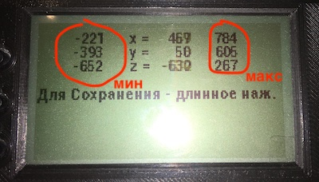

# Навигация

## Как включить или отключить Компас

Меню: `Параметры` -> `Использовать Компас`

* При подключенном аппаратном компасе - отображения сторон света на экране соответствует показаниям компаса.
        
* При отсутствии компаса - север всегда сверху

## Куда показывает стрелка

Направление нашего движения отображается как на карте, где мы в центре "карты". Самой карты нет, но вы понимаем, куда мы движемся относительно сторон света и где находится точка.

Начиная с версии `v0.5.3` отображения сторон света на экране соответствует показаниям компаса, если таковой есть. Т.е. при наличии компаса "карта" будет вращаться. При отсутствии компаса - север всегда будет вверху дисплея.

**Важно** помнить, принципиально - направление нашего движения, а не куда мы смотрим. Мы можем двигаться спиной вперёд.    

## Как менять отображение навигации на экране

* Два варианта отображения:
    
    * Страница "навигация + высотомер"
    
    * Страница "навигация" - тут тоже есть отображение высоты, но основное внимание навигации.

На земле меняется средней кнопкой.

После прыжка по умолчанию переходит на страницу "навигация + высотомер".

Изменить в меню: `Параметры` -> `Автоперекл. экрана` -> `После раскрытия`

## Как откалибровать компас

Т.к. производство китайских деталей не отличается стабильностью, показания, снимаемые магнитометром от экземпляра к экземпляру сильно расходятся.

Если компас показывает нестабильно направление севера, это значит, что магнетометр необходимо калибровать. Эта функция находится в меню `Система` - `Калибровка магнетометра`.

Суть калибровки заключается в нахождении минимальных и максимальных значений магнетометра. Для этого каждую из осей (X, Y, Z) необходимо направлять вдоль магнитных линий Земли.

> На широте Москвы магнитные линии направлены примерно под углом 60° к поверхности.

Для каждой оси прибора необходимо сделать две манипуляции - в прямом направлении магнитной линии и в обратном. Каждый раз будет определяться либо минимум,
либо максимум по выбранной оси. Минимум и максимум определяем незначительными отклонениями вдоль предполагаемой оси.

Для сохранения результатов - длинное нажатие средней кнопкой.

Для выхода из калибровки - короткое нажатие на среднюю кнопку.

## Питание GPS/GLONASS-приёмника

Управление питанием GPS/GLONASS-приёмника актуально для экономии заряда батареи.

По умолчанию, при включении устройства включается и приёмник.

Управлять питанием приёмника можно через меню `Параметры` -> `Управление режимом питания NAV-приёмника`.

Среди возможностей настройки:

* Ручное управление.
* Включение питания при включении устройства.
* Включение питания при записи трека.
* Включение питания на заданной высоте.
* Безусловное выключение при приземлении.

