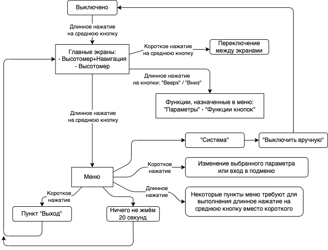
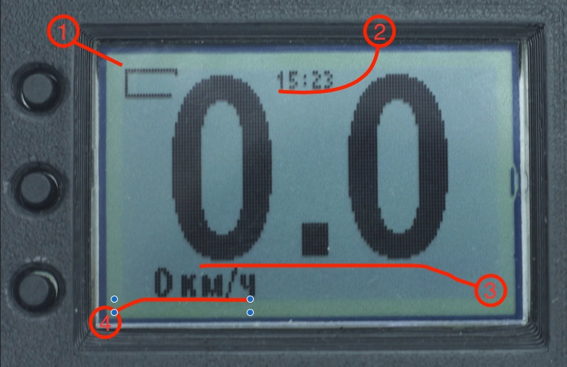
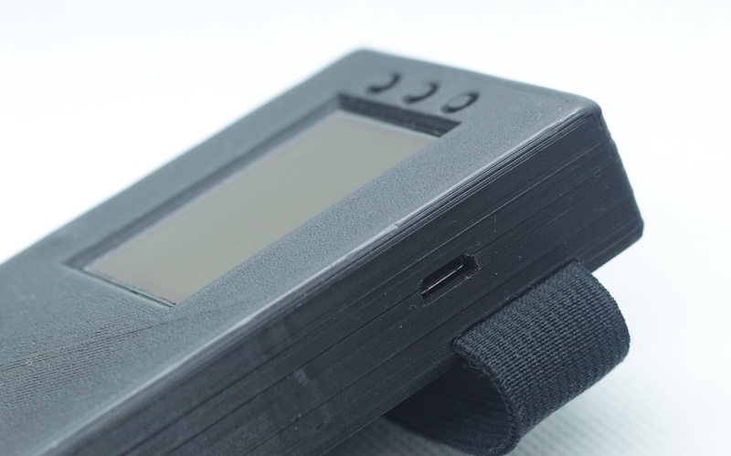
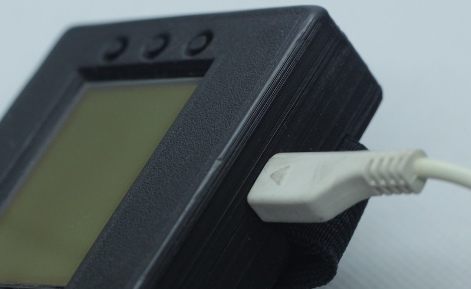
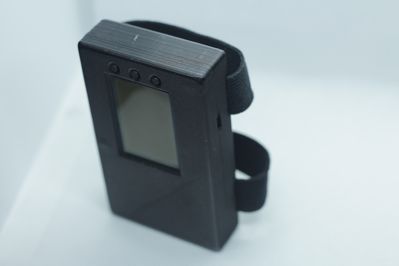
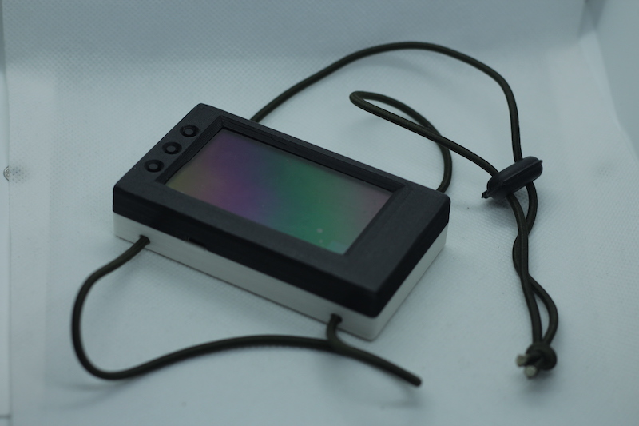
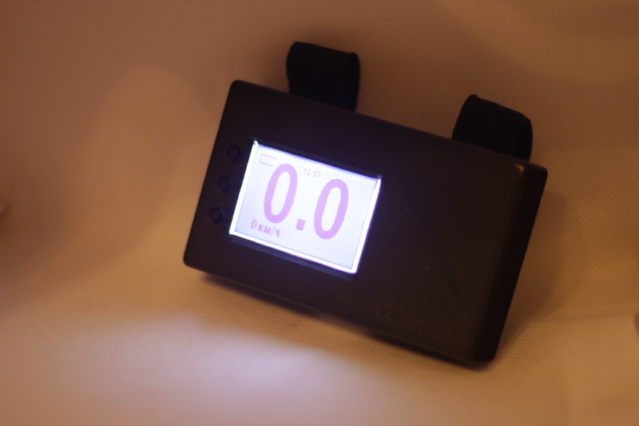
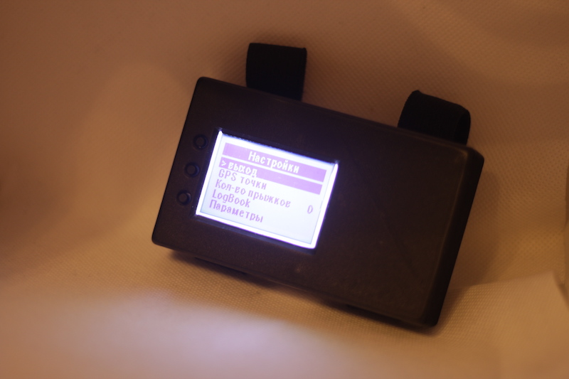

# Знакомство

Вы никогда не задавались вопросом:

> И `хде йа` нахожусь?!

Или может в 2 часа ночи интересовались:

> Как пройти в библиотеку?

**Привет!**

Я - `высотомер` и `GPS/GLONASS` в одном приборе.

Я `**НЕ**` являюсь навигатором. Только возвращалкой к заранее заданной точке. Покажу направление и расстояние до точки по прямой.

Пока я ещё как эксперементальная разработка. Жить этому проекту или нет, выберете Вы сами.

А по карте маршрут вам проложит Яндекс Навигатор, но не я!

## Функции устройства

* Классические для высотомера: отображение высоты, логбук и т.д.
* Приём сигнала навигации (GPS + GLONASS)
* Отображение направления и расстояния до заранее сохранённой точки (возвращалка)
* Отображение вертикальной (по барометру) и горизонтальной (по навигации) скоростей
* В логбуке сохраняются показания высотомера и координаты на местности
* Запись трека со всеми имеющимися параметрами барометра и GPS/GLONASS-приёмника
* Синхронизация по WiFi (по запросу пользователя): отправка логбука, треков, приём некоторых настроек с сервера

# Диаграмма управления

# Органы управления

Переключение между страницами на главном экране - нажатие на `среднюю кнопку`.

Кнопки `Вверх` и `Вниз` работают только по `длинному нажатию`, их функциями можно управлять в меню `Параметры` -> `Функции кнопок`.

##  Экран: GPS/GLONASS + Высотомер

1. Индикатор заряда батареи.
2. Текущее время (синхронизируется по GPS/GLONASS-сигналу).
3. Высота по барометру (метры).
4. Временное отображение режима высотомера (по текущей высоте, скорости и вертикальному направлению движения).
5. Вертикальная скорость (м/с).
6. Расстояние до выбранной точки (метры или километры).
7. Горизонтальная скорость.
8. Режим работы GPS/GLONASS приёмника (во включенном состоянии отображает число найденных спутников).
9. Номер выбранной точки и направление к ней.

Буквы `N` `S` `W` `E` - означают стороны света, как на компасе.

## Экран: Высотомер

1. Индикатор заряда батареи.
2. Текущее время (синхронизируется по GPS/GLONASS-сигналу).
3. Высота по барометру (километры).
4. Вертикальная скорость (км/ч).

# Как вбить конечную точку

Меню: `Navi-точки` - выбираем из трёх слотов хранения координат и сохраняем текущее местоположение.

Тут должна быть картинка

# Как заряжать

В это отверстие вставляем USB-шнурок одним концом, а другим в зарядку или ваш домашний компьютер:

# Крепление

* На руку

* На ногу

# Подсветка

Для ночных прыжочков:

